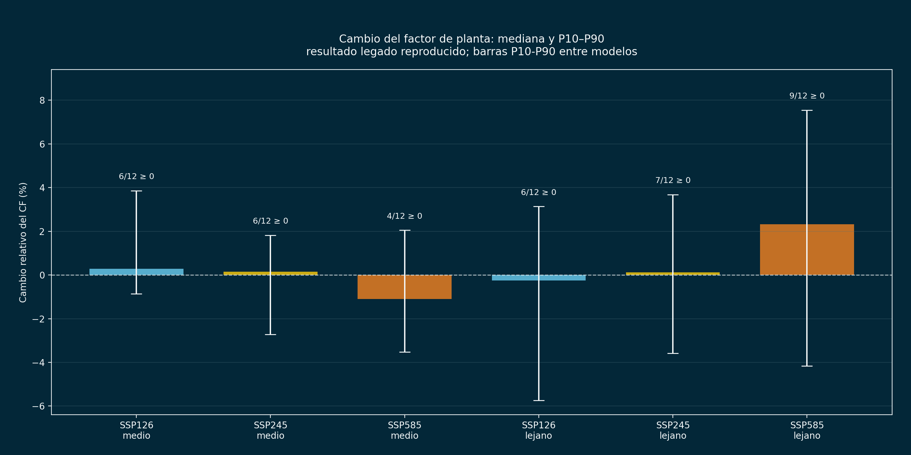
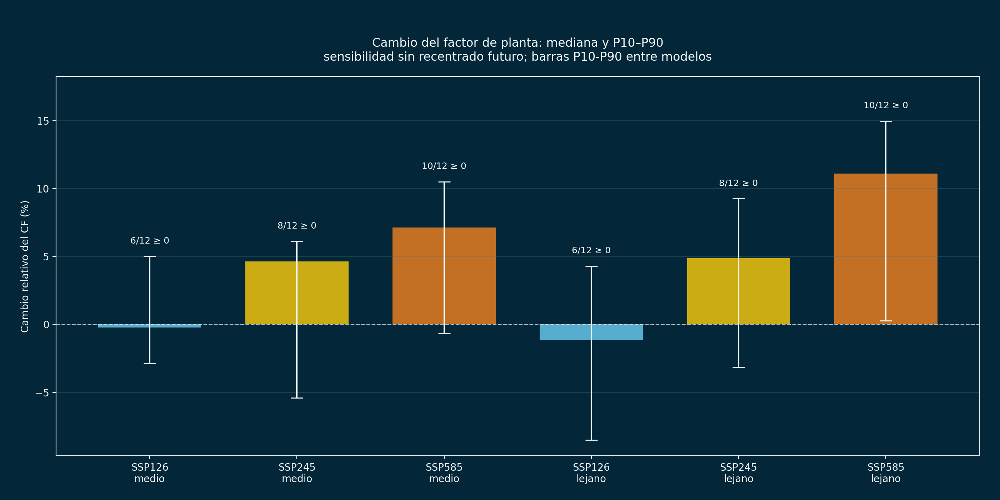
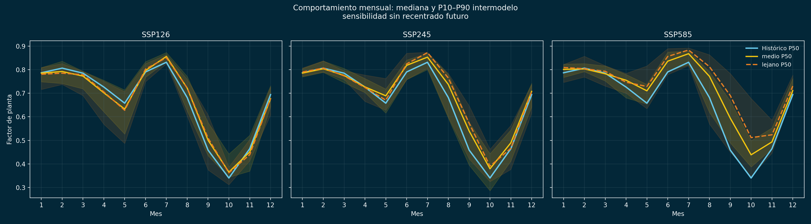
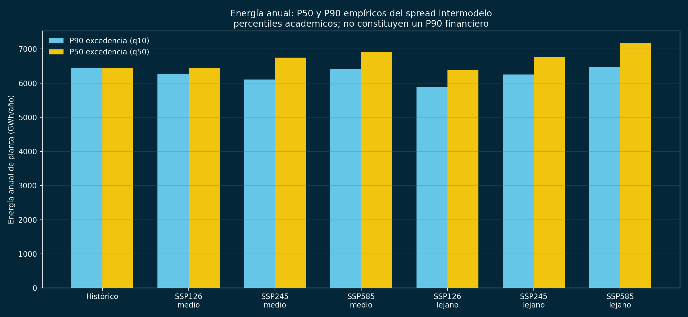
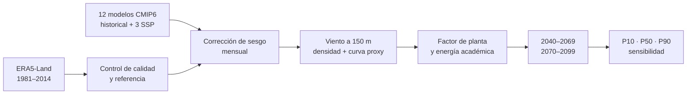

<h1 align="center">Riesgo climático del recurso eólico en La Guajira</h1>

<p align="center">
  <strong>De datos ERA5-Land y CMIP6 a evidencia para decisiones energéticas</strong><br>
  Caso académico inspirado en el clúster eólico Jemeiwaa Ka'I
</p>

<p align="center">
  
  
  
  
  
</p>

> **Conclusión ejecutiva.** El ensamble analizado no muestra evidencia robusta
> de una degradación sistemática del recurso eólico bajo SSP1-2.6, SSP2-4.5 y
> SSP5-8.5. La señal central es neutra a positiva, pero la dispersión entre
> modelos y la sensibilidad al método impiden traducirla en una garantía de
> producción o en un P90 financiero.



## El problema de decisión

¿Cómo podría cambiar la generación potencial de un parque eólico en La Guajira
entre 2040 y 2099, y cuánta confianza puede tener una empresa en esa señal?

El estudio representa una planta virtual de **162 turbinas × 6,8 MW = 1.101,6
MW**. Es una configuración académica inspirada en Jemeiwaa Ka'I, no la
configuración contractual del proyecto real. Ecopetrol reporta actualmente una
capacidad aproximada de 1.087 MW para el proyecto real.

| Pregunta empresarial | Evidencia obtenida | Lectura correcta |
|---|---:|---|
| ¿Se deteriora sistemáticamente el recurso? | No en la mediana de los tres escenarios | No equivale a ausencia de riesgo |
| ¿Cuál es el principal riesgo climático? | Dispersión intermodelo y metodológica | Trabajar con bandas, no sólo con promedios |
| ¿SSP5-8.5 muestra oportunidad? | Señal central positiva, especialmente sin recentrado | Es una sensibilidad, no un pronóstico garantizado |
| ¿La energía absoluta es bancable? | No | Requiere mediciones y pérdidas de ingeniería que aquí no existen |

## Resultados con incertidumbre explícita

Cambios relativos del factor de planta para 2070–2099 frente a 1981–2014:

| Escenario | Reproducción legada P50 | Banda P10–P90 | Sensibilidad sin recentrado P50 | Banda P10–P90 |
|---|---:|---:|---:|---:|
| SSP1-2.6 | −0,25 % | −5,73 a +3,13 % | −1,13 % | −8,49 a +4,29 % |
| SSP2-4.5 | +0,12 % | −3,59 a +3,68 % | +4,88 % | −3,14 a +9,25 % |
| SSP5-8.5 | +2,32 % | −4,16 a +7,54 % | +11,09 % | +0,28 a +14,96 % |

Los percentiles son **empíricos del ensamble de 12 modelos**; CMIP6 no es una
muestra probabilística equiprobable. La diferencia entre las dos columnas es
información útil: cuantifica cuánto depende la conclusión del tratamiento de
sesgo futuro.

### Prueba de robustez metodológica



### Estacionalidad del recurso



### Energía P50/P90: alcance académico



En esta figura, P90 de excedencia corresponde al cuantil bajo `q10`: un valor
superado por aproximadamente 90 % de la muestra empírica. **No es un P90
financiero.** Para entregarlo a una empresa hacen falta viento observado
horario/10-min, curva V172 certificada, estelas, disponibilidad, pérdidas
eléctricas y una propagación trazable de sus incertidumbres. El módulo
`run_bankability.py` bloquea el cálculo si esos insumos no están completos.

## Metodología



1. ERA5-Land diario aporta `u10`, `v10`, temperatura a 2 m y presión superficial.
2. Se fija un ensamble canónico de 12 GCM para evitar cambios silenciosos.
3. El viento se corrige por cuantiles mensuales y se extrapola de 10 a 150 m con
   exponente `α = 0,14`.
4. La potencia usa una curva V164-8 MW escalada a 6,8 MW, densidad cuando está
   disponible y pérdidas académicas del 10 %.
5. Se comparan 2040–2069 y 2070–2099 contra 1981–2014, con percentiles
   intermodelo e interanuales.
6. Una sensibilidad separada elimina el recentrado futuro, sin sobrescribir el
   resultado presentado.

El detalle de decisiones, fórmulas y hallazgos está en el
[informe de auditoría](INFORME_AUDITORIA.md).

## Reproducir sin descargar 5,7 GiB

El repositorio incluye código, tablas auditadas y una galería curada; **no
incluye datos crudos**.

```bash
git clone https://github.com/LindaCatalina/jemeiwaa-wind-energy-climate-risk.git
cd jemeiwaa-wind-energy-climate-risk
python -m venv .venv
```

Windows PowerShell:

```powershell
.venv\Scripts\Activate.ps1
python -m pip install -r requirements.txt
python run_portfolio.py --check-only
python run_portfolio.py
```

Linux/macOS:

```bash
source .venv/bin/activate
python -m pip install -r requirements.txt
python run_portfolio.py --check-only
python run_portfolio.py
```

`run_portfolio.py` reconstruye las cuatro figuras publicadas exclusivamente a
partir de los CSV versionados y verifica dimensiones, contenido y coherencia de
las tablas. No necesita red ni NetCDF.

## Reconstrucción completa desde las fuentes

Los manifiestos públicos conservan las 136 solicitudes ERA5-Land y los 215
`zstore` CMIP6 exactos utilizados. La descarga completa requiere una cuenta CDS,
aceptar sus términos, tiempo de cómputo y al menos 12 GB libres.

```bash
python -m pip install -r requirements-download.txt
python run_full_rebuild.py --dry-run
python run_full_rebuild.py
```

El flujo completo está protegido: en una carpeta que ya contenga derivados se
detiene antes de reemplazarlos. Fuentes, licencias y configuración de CDS:
[docs/DATOS.md](docs/DATOS.md).

## Habilidades demostradas

| Área | Evidencia en el proyecto |
|---|---|
| Ciencia de datos climáticos | ERA5-Land, CMIP6, calendarios climáticos, NetCDF, Xarray y Dask |
| Analítica para energía | Curva de potencia, densidad, factor de planta, energía y escenarios SSP |
| Incertidumbre | P10/P50/P90, dispersión intermodelo, variabilidad interanual y sensibilidad |
| Ingeniería reproducible | Entornos fijados, manifiestos de fuentes, CLI, pruebas y GitHub Actions |
| Calidad y comunicación | Auditoría de 575 NetCDF, validación de figuras y traducción a decisiones |
| Pensamiento crítico | Separación explícita entre resultado académico y evaluación bancable |

## Organización del repositorio

```text
├── data/                         # manifiestos; nunca datos crudos
├── Datos_Era5/                   # código de descarga y transformación ERA5
├── CMIP6_Guajira/                # código climático original y tablas legadas
├── reproducibilidad/             # auditoría, métricas, percentiles y sensibilidad
├── resultados_reproducibles/     # tablas completas y cuatro figuras curadas
├── bankability/                  # puerta de calidad para un futuro P90 financiero
├── docs/                         # datos, arquitectura y guía de GitHub
├── scripts/                      # descarga y controles de publicación
├── tests/                        # pruebas automáticas
├── run_portfolio.py              # reproducción rápida sin datos crudos
├── run_full_rebuild.py           # reconstrucción completa desde fuentes
└── run_reproducible.py           # auditoría científica con datos locales
```

## Calidad y transparencia

- Los 575 NetCDF locales abrieron correctamente en la auditoría profunda.
- Las dos figuras legadas vacías fueron identificadas y no se publican.
- La selección pública contiene cero datos crudos, cero archivos >10 MiB y cero
  duplicados exactos.
- GitHub Actions repite pruebas de estructura, tablas y figuras en cada cambio.
- Los scripts exploratorios defectuosos o sustituidos permanecen intactos
  localmente, pero no se publican; el punto de entrada público es inequívoco.

Consulte [resultados y lectura recomendada](resultados_reproducibles/RESUMEN_EJECUCION.md),
[arquitectura](docs/ESTRUCTURA.md), [reproducibilidad](docs/REPRODUCIBILIDAD.md) y
[publicación clic por clic](docs/GITHUB_PUBLICACION.md).

## Autores y citación

**Linda Catalina Correa Lozano** · **Juan Camilo Bedoya Carmona**  
Proyecto académico de Climatología. La forma de citación está en
[`CITATION.cff`](CITATION.cff). La licencia de reutilización debe ser acordada
por ambos autores antes de publicarla.

### Fuentes principales

- [ERA5-Land daily statistics — Copernicus CDS](https://cds.climate.copernicus.eu/datasets/derived-era5-land-daily-statistics?tab=documentation)
- [Pangeo CMIP6 Cloud — acceso a datos](https://pangeo-data.github.io/pangeo-cmip6-cloud/accessing_data.html)
- [Vestas V172-7.2 MW](https://www.vestas.com/en/energy-solutions/onshore-wind-turbines/enventus-platform/V172-7-2-MW)
- [Proyecto Jemeiwaa Ka'I — Ecopetrol](https://www.ecopetrol.com.co/wps/portal/Home/es/noticias/detalle/ecopetrol-suscribio-un-acuerdo-marco-de-inversion-ami-con-aes)
