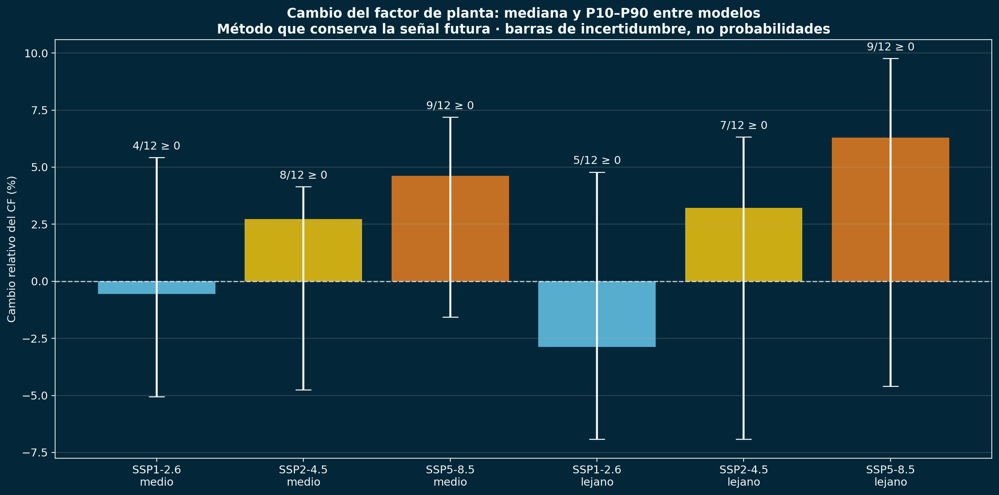
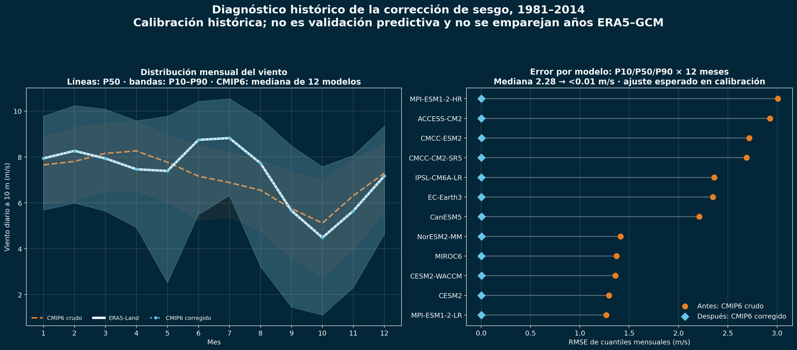
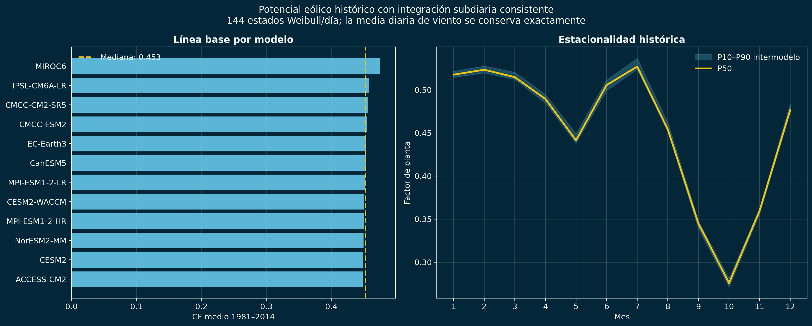
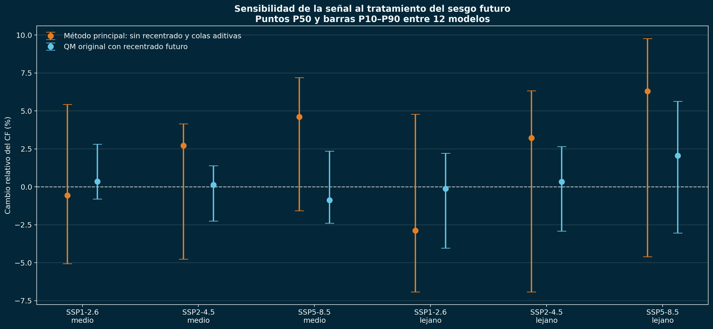
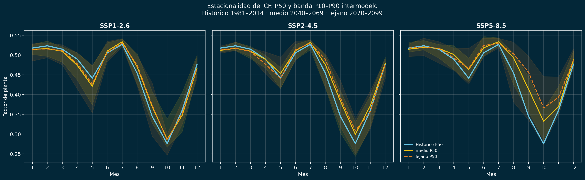
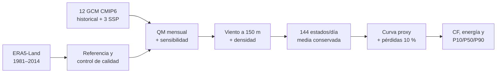

<h1 align="center">Riesgo climático del recurso eólico en La Guajira</h1>

<p align="center">
  <strong>De ERA5-Land y un ensamble CMIP6 a evidencia reproducible para decisiones energéticas</strong><br>
  Caso académico inspirado en el clúster eólico Jemeiwaa Ka'I
</p>

<p align="center">
  
  
  
  
  
</p>

> **Conclusión ejecutiva.** El ensamble no muestra una degradación robusta y
> común a los tres escenarios. Para 2070–2099, el método que conserva la señal
> futura produce medianas de −2,88 % (SSP1-2.6), +3,21 % (SSP2-4.5) y +6,29 %
> (SSP5-8.5), pero todas las bandas P10–P90 incluyen cambios negativos. La
> decisión empresarial debe considerar la dispersión entre modelos y la
> sensibilidad metodológica, no solamente la mediana.



## Pregunta de decisión

¿Cómo podría cambiar la generación potencial de una planta eólica virtual en
La Guajira entre 2040 y 2099, y cuánta confianza puede asignarse a esa señal?

El caso representa **162 turbinas × 6,8 MW = 1.101,6 MW**. Es una configuración
académica inspirada en Jemeiwaa Ka'I, no una descripción contractual del
proyecto real.

| Pregunta empresarial | Evidencia | Interpretación responsable |
|---|---:|---|
| ¿Existe una pérdida sistemática del recurso? | No en la mediana de todos los escenarios | Algunas simulaciones sí proyectan disminuciones |
| ¿Cuál es el principal riesgo? | Dispersión intermodelo y sensibilidad al sesgo | Trabajar con bandas y escenarios |
| ¿SSP5-8.5 implica una mejora segura? | P50 positivo, P10 negativo | No es una garantía de aumento |
| ¿La energía calculada es bancable? | No | Es una equivalencia académica, no un P90 financiero |

## Corrección metodológica clave

La versión inicial aplicaba una síntesis Weibull que conservaba solo cerca del
**62,65 %** del viento medio diario. Aplicar la curva de potencia directamente
a la media diaria producía el problema opuesto: un CF histórico cercano a
0,65. Ambos caminos eran incompatibles.

La versión actual utiliza **144 estados intradiarios Weibull deterministas por
día**, normalizados para conservar exactamente la velocidad media diaria antes
de integrar la curva de potencia. Con una sola definición para toda la cadena:

- la mediana histórica entre los 12 modelos es **CF = 0,453**;
- el rango de medias históricas por modelo es **0,448–0,475**;
- el P50 mensual histórico varía aproximadamente entre **0,28 y 0,53**;
- energía, CF anual y estacionalidad se derivan ahora del mismo cálculo.

Los 144 estados son una cuadratura estadística, **no viento observado de 10
minutos**. La explicación y la ecuación de conservación están en
[Metodología](docs/METODOLOGIA.md).

### Diagnóstico histórico de la corrección



La comparación se realiza sobre P10, P50 y P90 mensuales de 1981–2014, sin
emparejar años individuales de ERA5-Land y los GCM. El error residual casi
nulo es esperado porque estos cuantiles históricos son los objetivos de
calibración del Quantile Mapping; por tanto, la figura documenta el ajuste
histórico y **no constituye validación predictiva independiente**.
Los valores auditables están en
[`validacion_cuantiles_mensuales.csv`](results/tables/validacion_cuantiles_mensuales.csv)
y
[`validacion_error_cuantiles_por_modelo.csv`](results/tables/validacion_error_cuantiles_por_modelo.csv).

## Línea base histórica



La estacionalidad conserva el patrón de máximos alrededor de junio–julio y
mínimos en septiembre–octubre. Las diferencias entre modelos son pequeñas en
el histórico porque la corrección por cuantiles alinea sus climatologías con
ERA5-Land.

## Cambios futuros e incertidumbre

Resultados para 2070–2099 respecto de 1981–2014:

| Escenario | P10 | P50 | P90 | Modelos con cambio ≥ 0 |
|---|---:|---:|---:|---:|
| SSP1-2.6 | −6,92 % | −2,88 % | +4,78 % | 5/12 |
| SSP2-4.5 | −6,92 % | +3,21 % | +6,33 % | 7/12 |
| SSP5-8.5 | −4,60 % | +6,29 % | +9,76 % | 9/12 |

P10, P50 y P90 son percentiles empíricos del ensamble; los modelos CMIP6 no
constituyen una muestra probabilística equiprobable.

### Sensibilidad al tratamiento del sesgo futuro



El procedimiento original recentraba cada escenario futuro hacia la mediana
histórica y reducía parte de la señal climática. Por eso se conserva como
comparación y el método sin recentrado se utiliza como resultado principal.
La distancia entre ambos es incertidumbre metodológica explícita.

### Comportamiento mensual



## Energía: alcance estrictamente académico

Las tablas incluyen energía anual equivalente calculada como:

```text
Energía equivalente = CF anual × 1.101,6 MW × 8.760 h
```

El histórico del método principal tiene aproximadamente **4.000 GWh de q10** y
**4.400 GWh de q50**. Estas cifras permiten verificar coherencia matemática,
pero **no constituyen una estimación bancable ni un P90 financiero**. Para ello
se necesitan viento horario/10-min observado, curva V172 certificada, estelas,
disponibilidad, pérdidas eléctricas, restricciones y propagación trazable de
incertidumbres. Consulte [Limitaciones](docs/LIMITACIONES.md).

## Metodología resumida



Periodos: histórico 1981–2014, horizonte medio 2040–2069 y horizonte lejano
2070–2099. El detalle está en [Metodología](docs/METODOLOGIA.md).

## Reproducción rápida sin datos crudos

```bash
git clone https://github.com/LindaCatalina/jemeiwaa-wind-energy-climate-risk.git
cd jemeiwaa-wind-energy-climate-risk
python -m venv .venv
python -m pip install -r requirements.txt
python scripts/rebuild_figures.py --check-only
python scripts/rebuild_figures.py
```

Este nivel reconstruye las cinco figuras únicamente desde los CSV
versionados y verifica tablas, rangos físicos, dimensiones y contenido. No
necesita red ni NetCDF.

## Reconstrucción completa desde fuentes

```bash
python -m pip install -r requirements-download.txt
python scripts/run_full_rebuild.py --dry-run
python scripts/run_full_rebuild.py
```

Requiere una cuenta CDS, aceptar sus términos, conexión a las fuentes CMIP6,
tiempo de cómputo y espacio en disco. Los 136 pedidos ERA5-Land y 215 almacenes
CMIP6 utilizados están fijados en `data/`. Consulte [Datos](docs/DATOS.md) y
[Reproducibilidad](docs/REPRODUCIBILIDAD.md).

## Estructura

```text
├── README.md
├── CITATION.cff
├── requirements.txt
├── requirements-download.txt
├── .github/                 # validación automática
├── data/                    # manifiestos de fuentes, no datos crudos
├── Datos_Era5/              # preparación de ERA5-Land
├── CMIP6_Guajira/           # sesgo y productos climáticos
├── reproducibilidad/        # núcleo científico y percentiles
├── scripts/                 # ejecución, descargas y controles
├── tests/                   # pruebas automáticas
├── results/
│   ├── figures/             # cinco figuras públicas verificadas
│   └── tables/              # resultados auditables
└── docs/
    ├── DATOS.md
    ├── METODOLOGIA.md
    ├── REPRODUCIBILIDAD.md
    └── LIMITACIONES.md
```

Los NetCDF, notebooks exploratorios, resultados sustituidos y documentos de
preparación permanecen fuera de GitHub mediante `.gitignore`.

## Habilidades demostradas

- Python científico: NumPy, pandas, Xarray, Matplotlib y NetCDF.
- Datos climáticos: ERA5-Land, CMIP6, calendarios y escenarios SSP.
- Analítica energética: extrapolación vertical, densidad, curva de potencia,
  CF y energía equivalente.
- Incertidumbre: P10/P50/P90, dispersión intermodelo y sensibilidad de método.
- Ingeniería reproducible: manifiestos, entradas CLI, pruebas y GitHub Actions.
- Control de calidad: detección y corrección de una inconsistencia no lineal sin
  ocultar las limitaciones del estudio.

## Autores y citación

**Linda Catalina Correa Lozano** · **Juan Camilo Bedoya Carmona**  
Proyecto académico de Climatología. La citación se encuentra en
[`CITATION.cff`](CITATION.cff).

### Fuentes principales

- [ERA5-Land daily statistics — Copernicus CDS](https://cds.climate.copernicus.eu/datasets/derived-era5-land-daily-statistics?tab=documentation)
- [Pangeo CMIP6 Cloud — acceso](https://pangeo-data.github.io/pangeo-cmip6-cloud/accessing_data.html)
- [Vestas V172-7.2 MW](https://www.vestas.com/en/energy-solutions/onshore-wind-turbines/enventus-platform/V172-7-2-MW)
- [Proyecto Jemeiwaa Ka'I — Ecopetrol](https://www.ecopetrol.com.co/wps/portal/Home/es/noticias/detalle/ecopetrol-suscribio-un-acuerdo-marco-de-inversion-ami-con-aes)
